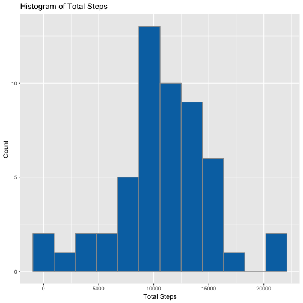
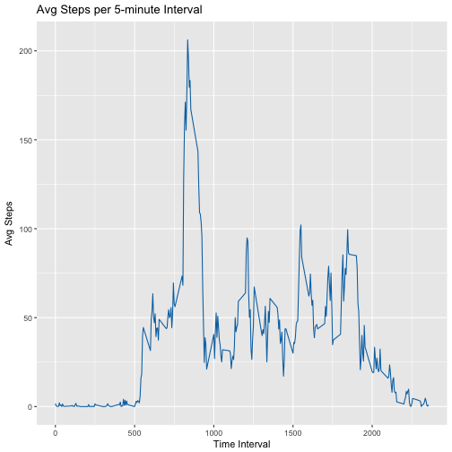
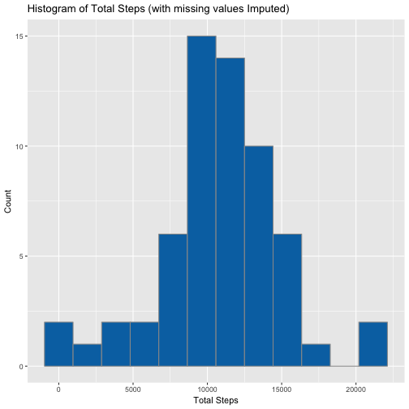
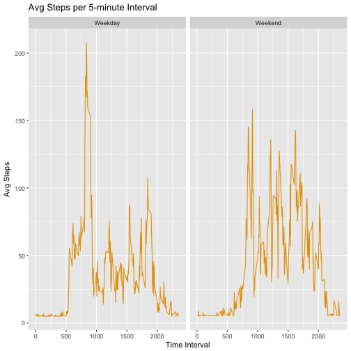
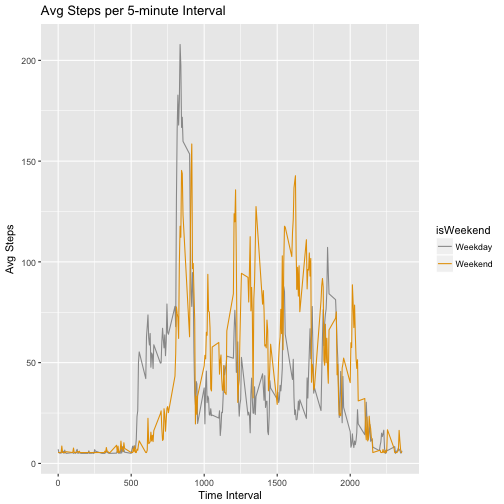

## Assignment 1

###Introduction

It is now possible to collect a large amount of data about personal movement using activity monitoring devices such as a Fitbit, Nike Fuelband, or Jawbone Up. These type of devices are part of the “quantified self” movement – a group of enthusiasts who take measurements about themselves regularly to improve their health, to find patterns in their behavior, or because they are tech geeks. But these data remain under-utilized both because the raw data are hard to obtain and there is a lack of statistical methods and software for processing and interpreting the data.

This assignment makes use of data from a personal activity monitoring device. This device collects data at 5 minute intervals through out the day. The data consists of two months of data from an anonymous individual collected during the months of October and November, 2012 and include the number of steps taken in 5 minute intervals each day.

The data for this assignment can be downloaded from the course web site:

- Dataset: [Activity monitoring data](https://d396qusza40orc.cloudfront.net/repdata%2Fdata%2Factivity.zip)

The variables included in this dataset are:

- **steps (int)**: Number of steps taking in a 5-minute interval (missing values are coded as `NA`)
- **date (date)**: The date on which the measurement was taken in YYYY-MM-DD format
- **interval (int)**: Identifier for the 5-minute interval in which measurement was taken

The dataset is stored in a comma-separated-value (CSV) file and there are a total of 17,568 observations in this dataset.


```r
## use colorblind-friendly palettes

## palette with grey:
cbPalette <- c("#999999", "#E69F00", "#56B4E9", "#009E73", "#F0E442", "#0072B2", "#D55E00", "#CC79A7")

maincol <- cbPalette[6]
secondarycol <- cbPalette[1]
```

### Loading and preprocessing the data


```r
## use readr and read_csv to read data into a tibble for easier viewing of large datasets
library(readr)

## unzip the file included in the repository if not already available
unzip("activity.zip")

## read in the data
activity <- read_csv("activity.csv")
```

```
## Parsed with column specification:
## cols(
##   steps = col_integer(),
##   date = col_date(format = ""),
##   interval = col_integer()
## )
```

```r
## examine the data structure
str(activity)
```

```
## Classes 'tbl_df', 'tbl' and 'data.frame':	17568 obs. of  3 variables:
##  $ steps   : int  NA NA NA NA NA NA NA NA NA NA ...
##  $ date    : Date, format: "2012-10-01" "2012-10-01" ...
##  $ interval: int  0 5 10 15 20 25 30 35 40 45 ...
##  - attr(*, "spec")=List of 2
##   ..$ cols   :List of 3
##   .. ..$ steps   : list()
##   .. .. ..- attr(*, "class")= chr  "collector_integer" "collector"
##   .. ..$ date    :List of 1
##   .. .. ..$ format: chr ""
##   .. .. ..- attr(*, "class")= chr  "collector_date" "collector"
##   .. ..$ interval: list()
##   .. .. ..- attr(*, "class")= chr  "collector_integer" "collector"
##   ..$ default: list()
##   .. ..- attr(*, "class")= chr  "collector_guess" "collector"
##   ..- attr(*, "class")= chr "col_spec"
```

```r
## and look at a summary of the fields
summary(activity)
```

```
##      steps             date               interval     
##  Min.   :  0.00   Min.   :2012-10-01   Min.   :   0.0  
##  1st Qu.:  0.00   1st Qu.:2012-10-16   1st Qu.: 588.8  
##  Median :  0.00   Median :2012-10-31   Median :1177.5  
##  Mean   : 37.38   Mean   :2012-10-31   Mean   :1177.5  
##  3rd Qu.: 12.00   3rd Qu.:2012-11-15   3rd Qu.:1766.2  
##  Max.   :806.00   Max.   :2012-11-30   Max.   :2355.0  
##  NA's   :2304
```
Everything looks about right, but there are quite a few `NA` values in the `steps` field. This indicates that there are days or at least some intervals of days where there are no recorded values. This could affect our analysis. We'll come back to that later.

### What is mean total number of steps taken per day?

Now that we have read in the data, let's calculate the total number of steps per day. For this calculation, we'll ignore the `NA` values.


```r
## plots in this assignment use ggplot2 and data manipulation relies on the dplyr package

library(ggplot2)
library(dplyr)
```

```
## 
## Attaching package: 'dplyr'
```

```
## The following objects are masked from 'package:stats':
## 
##     filter, lag
```

```
## The following objects are masked from 'package:base':
## 
##     intersect, setdiff, setequal, union
```

```r
## for this exercise we will ignore the NA's
## drop any incomplete cases prior to calculating the total and mean values

activityComplete <- activity[complete.cases(activity)==TRUE,]

## calculate the total steps per day, and the daily mean and median

activityCalc <- activityComplete %>%
  group_by(date) %>%
  summarize(totalSteps = sum(steps))

## peek at the first 10 values for the steps variable

head(activityCalc$totalSteps, 10)
```

```
##  [1]   126 11352 12116 13294 15420 11015 12811  9900 10304 17382
```

Next, we'll plot a histogram of the total number of steps per day.


```r
## plot a histogram of the total number of steps per day

ggplot(activityCalc, aes(x=totalSteps)) +
  geom_histogram(bins=12, col=secondarycol, fill=maincol) +
  labs(list(title="Histogram of Total Steps",
            x="Total Steps",
            y="Count"))
```



Let's take a look at the mean and median values for daily number of steps.


```r
## report the mean and median values
mean(activityCalc$totalSteps)
```

```
## [1] 10766.19
```

```r
median(activityCalc$totalSteps)
```

```
## [1] 10765
```

### What is the average daily activity pattern?

Next we'll examine the data to see if there are any daily activity patterns. We can look at the average number of steps for each time interval.


```r
activityInterval <- activityComplete %>%
  group_by(interval) %>%
  summarize(meanSteps = mean(steps))

ggplot(activityInterval, aes(x=interval, y=meanSteps)) +
  geom_line(col=maincol) +
  labs(list(title="Avg Steps per 5-minute Interval",
            x="Time Interval",
            y="Avg Steps") )
```



We can definitely see a clear peak in activity. What's the interval with the highest mean number of steps?


```r
## which interval has the maximum number of average steps
activityInterval[activityInterval$meanSteps == max(activityInterval$meanSteps),]$interval
```

```
## [1] 835
```

### Imputing missing values

Previously, we saw that there were a number of data points where the `steps` variable contained `NA` values. We chose to ignore these values initially, but we might want to try to fill in the missing data instead. There are a number of different ways to do that, but for the sake of simplicity, we'll fill in missing values (`NA`s) with the average (`mean`) number of steps for that particular day of the week.

Let's take a look again at the number of `NA`s in the `step` variable. We can use the `summary` function as a shortcut. 


```r
## how many missing values are there

summary(activity$steps)[7]
```

```
## NA's 
## 2304
```

Now we'll impute the missing values. First we'll add a couple new fields to the dataset:

- **weekDay (char)**   - full name of the day of the week for the observation
- **isWeekend (bool)** - an indicator with two levels (TRUE=Weekend, FALSE=Weekday)


```r
library(chron)

## add some fields to the table:
## weekDay, char    - full name of the day of the week for the observation
## isWeekend, bool  - TRUE/FALSE indicator if the day is a weekend (TRUE) or weekday(FALSE)

activity <- activity %>%
  dplyr::mutate(weekDay = weekdays(date),
                isWeekend = as.factor(ifelse(is.weekend(date)==TRUE, "Weekend", "Weekday")))
```

Next, we'll calculate the mean number of days for each day of the week, then use that value to fill in the missing `NA`s. Any time the `steps` variable is `NA`, set it equal to the mean number of steps for that day of the week.


```r
## get the mean number of steps for each weekday

meanbyWeekDay <- activity %>%
  group_by(weekDay) %>%
  summarize(weekDayAvgSteps = mean(steps, na.rm=TRUE))

## fill-in imputed values for missing days using the mean value for that weekday

activityFilled <- activity %>%
  left_join(meanbyWeekDay, by=c("weekDay")) %>%
  mutate(imputedSteps = ifelse(is.na(steps)==TRUE, weekDayAvgSteps, steps))

## calculate the total (filled / imputed) steps per day, and the daily mean and median

activityFillSum <- activityFilled %>%
  group_by(date) %>%
  summarize(meanSteps = mean(imputedSteps),
            medianSteps = median(imputedSteps),
            totalSteps = sum(imputedSteps))
```

Now we can take a look at the same histogram as we saw before, using the filled-in data with the values we just imputed.


```r
ggplot(activityFillSum, aes(x=totalSteps)) +
  geom_histogram(bins=12, col=secondarycol, fill=maincol) +
  labs(list(title="Histogram of Total Steps (with missing values Imputed)",
            x="Total Steps",
            y="Count"))
```



Looks pretty similar. Let's check to see how the data has changed by filling in the `NA` values.


```r
## report the mean and median values
mean(activityFillSum$totalSteps)
```

```
## [1] 10821.21
```

```r
median(activityFillSum$totalSteps)
```

```
## [1] 11015
```

```r
## original mean and median values
mean(activityCalc$totalSteps)
```

```
## [1] 10766.19
```

```r
median(activityCalc$totalSteps)
```

```
## [1] 10765
```

```r
## differences
mean(activityFillSum$totalSteps) - mean(activityCalc$totalSteps)
```

```
## [1] 55.02092
```

```r
median(activityFillSum$totalSteps) - median(activityCalc$totalSteps)
```

```
## [1] 250
```

After imputing or filling in the missing `NA` values, the mean number of steps per day increased by 55.0209226 and the median number of steps per day increased by 250.

### Are there differences in activity patterns between weekdays and weekends?

The dataset we just used has a variable that we added indicating whether or not a particular date is a weekend or a weekday. We can use that to look at the differences in activity patterns (if any) between weekdays and weekends.

First we'll take a look at total steps plotted by time, but break weekends and weekdays into a separate facet or panel.


```r
activityIntWeekend <- activityFilled %>%
  group_by(interval, isWeekend) %>%
  summarize(meanSteps = mean(imputedSteps))

## plot the average steps per 5-minute interval with separate facets for weekends and weekdays
ggplot(activityIntWeekend, aes(x=interval, y=meanSteps)) +
  geom_line(col=cbPalette[2]) +
  scale_color_manual(values = cbPalette) +
  labs(list(title="Avg Steps per 5-minute Interval",
            x="Time Interval",
            y="Avg Steps") ) +
  facet_grid(~isWeekend)
```



The side-by-side plot is a nice visual. We can also plot weekends and weekdays using different colors for easier comparison.


```r
## or viewed another way (overlay weekends and weekdays with different colors)
 
ggplot(activityIntWeekend, aes(x=interval, y=meanSteps, col=isWeekend)) +
  geom_line() +
  scale_color_manual(values=cbPalette) +
  labs(list(title="Avg Steps per 5-minute Interval",
            x="Time Interval",
            y="Avg Steps") )
```



Looking at it this way, the differences in activity trends between weekends and weekdays are a bit clearer. Weekdays show more activity earlier in the day, with a spike around noon, and lower activity in the afternoon and evening hours. Weekends show a later start to the day, with very little activity before noon, and generally higher activity levels in the afternoon and evening.
